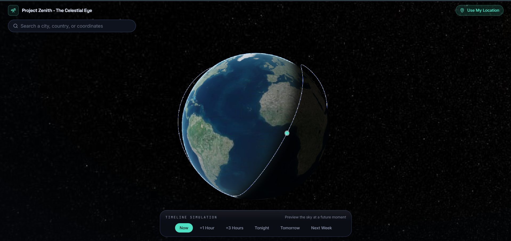
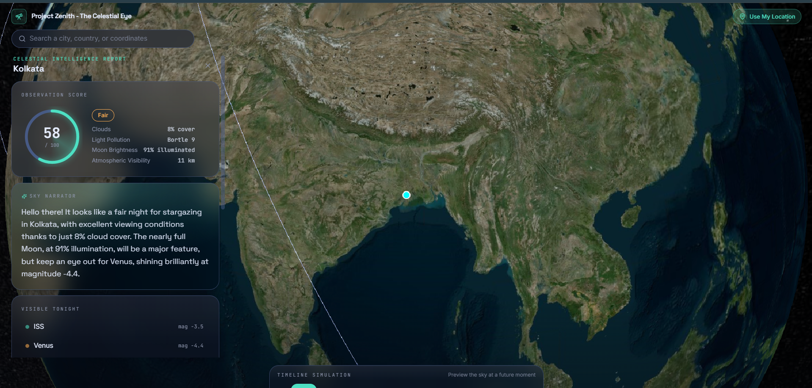
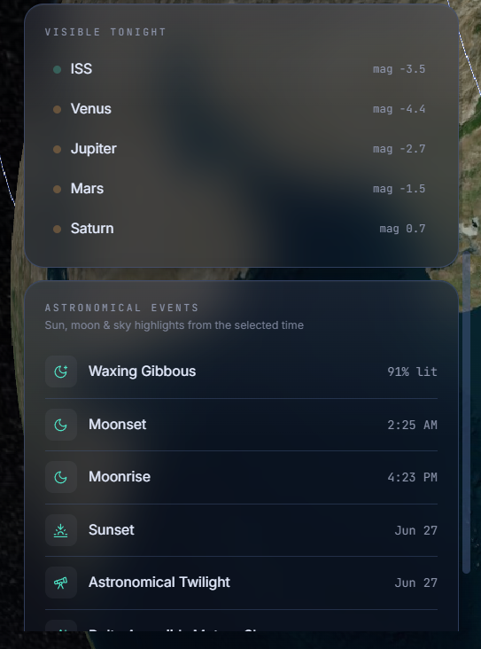

<div align="center">

# 🌌 Project Zenith: The Celestial Eye

**Point anywhere on Earth and instantly understand everything happening in the sky above it.**

[](https://nextjs.org/)
[](https://expressjs.com/)
[](https://www.typescriptlang.org/)
[](https://cesium.com/platform/cesiumjs/)
[](https://ai.google.dev/)
[](#license)
[](#known-limitations)

Built by **Team Juno** for **AstralWeb Innovate 2026**.

</div>

## Table of Contents

```
Cover
│
├── Project Overview
├── Problem Statement
├── Solution Overview
│
├── Website Functionality
├── Unique Features
│
├── Technology Stack & Dependencies
├── Architecture Overview
├── Implementation Approach
│
├── Project Structure
├── Core Modules
├── External APIs Used
├── AI Components
├── Caching Strategy
├── Frontend Architecture
├── Backend Architecture
│
├── Installation & Local Setup
├── Production Deployment
├── API Endpoints
│
├── Screenshots
├── Known Limitations
├── Future Enhancements
├── Contributors
├── GitHub Repository
├── License
└── Acknowledgements

```

## Project Overview

**Project Zenith** is an interactive web platform that turns the abstract, fragmented world of
astronomical and satellite data into a single, intuitive experience. Spin an interactive 3D Earth,
click any point (or search any place on the planet), and Zenith assembles a **live celestial report**
for that exact location: how good the sky is for observing right now, what's visible tonight, where the
International Space Station is, what events are coming up, and a plain-English narration of the sky —
all computed from **real, live data sources**.

It was built for **AstralWeb Innovate 2026**, a national-level web-development challenge themed around
visualizing real-time celestial activity above any location on Earth.

**Live Demo:** https://project-zenith-mocha.vercel.app/

## Problem Statement

Understanding what's in the sky above you is surprisingly hard. The data exists, but it is:

- **Fragmented** — orbital elements, ephemerides, weather, light pollution, and moon phase each live in
  a different API with a different format.
- **Raw and technical** — TLE sets, equatorial coordinates, and magnitudes mean nothing to a casual
  stargazer.
- **Static and non-spatial** — most tools give you a table for one city, not an explorable globe.
- **Disconnected from observing conditions** — knowing a planet is *up* is useless if it's cloudy or the
  sky is washed out by city lights or a full moon.

There is no single, beautiful place to ask *"what's happening in the sky right here, right now, and is it
worth looking up?"*

## Solution Overview

Zenith answers that question in one screen. A **CesiumJS 3D globe** is the entry point: select a location
and the backend **aggregation gateway** fans out to half a dozen real data sources in parallel, fuses
them through a set of pure computational engines, and returns a single **Celestial Report**. The frontend
renders that report as a live dashboard — an **Observation Quality Score**, a **Visible Tonight** list, a
scrubbable **Timeline** that re-simulates the sky for *Now → Next Week*, **Upcoming Events**, and an
AI-written **Sky Narration**.

Every upstream call is timeout-bounded with a graceful fallback, and every result is cached, so the
experience stays instant and **never breaks** even when an external API is slow, rate-limited, or down.

---

## Website Functionality

- 🌍 **Interactive 3D Earth** — CesiumJS globe with click-to-select, auto-rotation, and a live ISS marker.
- 🔭 **Observation Quality Score (0–100)** — a single number for "how good is the sky here?", computed
  from real cloud cover, visibility, moon illumination, and light pollution.
- ⏱️ **Timeline Simulation** — scrub *Now · +1h · +3h · Tonight · Tomorrow · Next Week* and watch the
  entire report (weather, moon, planet positions, events, narration) genuinely re-simulate.
- ✨ **Visible Tonight** — real planets and the ISS visible from your location, with magnitudes and
  visibility windows.
- 🛰️ **Live Satellite / ISS Tracking** — real TLE propagation via `satellite.js` plus live position,
  altitude, and velocity.
- 📅 **Upcoming Astronomical Events** — sunset, astronomical twilight, moonrise/moonset, moon phase, the
  next meteor shower, and ISS passes — ordered and localized to your timezone.
- 🗣️ **AI Sky Narration** — a Google Gemini-written, typewriter-rendered summary of your sky, regenerable
  on demand.
- 🔎 **Worldwide Location Search & Geolocation** — type any place or click the globe to reverse-geocode.
- 🧭 **Object Inspector** — per-object detail (altitude, velocity, visibility window).
- 📱 **Responsive Dashboard** — desktop, tablet, and mobile.

## Unique Features

What sets Zenith apart from a typical "astronomy lookup" app:

1. **A fused Observation Quality Score, not just raw data.** Zenith doesn't just tell you a planet is up —
   it weighs clouds, atmospheric visibility, moonlight, and light pollution into one honest "is it worth
   looking up?" score.
2. **Genuinely time-aware simulation.** The Timeline isn't cosmetic. Moving the scrubber re-queries weather
   for a *different real hour*, recomputes moon phase/illumination for that instant, fetches planet
   ephemerides for the target date, and rebuilds the event list — so *Tonight* and *Next Week* really
   differ.
3. **Resilience as a feature.** Every external dependency is wrapped in a timeout + deterministic fallback.
   No N2YO key? The ISS still shows real position; only the "next pass" window is omitted. Gemini quota
   exhausted? Narration falls back to a templated summary built from the *same real numbers*. The UI is
   never left empty.
4. **Dependency-free astronomy.** Sun/moon/twilight times and moon phase are computed locally from a
   compact SunCalc port — accurate to ~a minute, no API, no key, no rate limit.
5. **Instant by design.** A layered TTL cache (per-upstream → report → narration) turns a ~10–12s cold
   report into a **3 ms** warm one, and shares weather/TLE/light-pollution across every timeline step.

---

## Technology Stack

### Frontend
- **Next.js 15** (App Router) + **React 19**
- **TypeScript** (strict mode)
- **CesiumJS** — 3D globe & geospatial rendering
- **Three.js** — ambient starfield
- **Tailwind CSS** — styling
- **Framer Motion** — animation
- **Zustand** — client state
- **TanStack Query** — server-state, caching, request lifecycle
- **lucide-react** — icons
- **class-variance-authority · clsx · tailwind-merge** — styling utilities

### Backend
- **Node.js** + **Express 5**
- **TypeScript**, run directly with **tsx**
- **Socket.IO** — real-time channel
- **axios** — upstream HTTP
- **satellite.js** — TLE/SGP4 orbital propagation
- **@google/genai** — Gemini AI narration
- In-process **TTL cache** (Redis-ready interface)

### Tooling
- Git & GitHub · Vercel (frontend) · Render (backend) · npm

---

## Architecture Overview

Zenith is a two-tier system. The **Next.js frontend** never talks to third-party APIs directly — it talks
only to the **Express aggregation gateway**, which is responsible for fanning out, fusing, caching, and
degrading gracefully. This keeps API keys server-side, normalizes wildly different payloads into one clean
contract, and makes the whole thing cacheable.

```text
                    ┌──────────────────────────────────────────────┐
                    │                 FRONTEND (Next.js 15)         │
   User ──────────► │  CesiumJS Globe · Dashboard · Timeline        │
                    │  Zustand (UI state) · TanStack Query (server) │
                    └───────────────────────┬──────────────────────┘
                                             │  GET /api/report/:lat/:lng?t=…
                                             ▼
                    ┌──────────────────────────────────────────────┐
                    │          BACKEND — Express Aggregation Gateway │
                    │  Controllers → Aggregation Services → Engines  │
                    │  Layered TTL Cache · timeout + fallback guards │
                    └───────────────────────┬──────────────────────┘
              parallel fan-out (timeout-bounded, individually cached)
        ┌───────────────┬───────────┬───────────┬───────────┬──────────────┐
        ▼               ▼           ▼           ▼           ▼              ▼
   NASA Horizons   Open-Meteo   CelesTrak    Open Notify   Light-      Google
   (ephemerides)   (weather +   (ISS TLE)    (live ISS     Pollution   Gemini
                    geocoding)               lat/lng)      dataset     (narration)
                                                              + SunCalc engine
                                                              (local sun/moon)
```

## Implementation Approach

Project Zenith follows a modular client-server architecture designed for scalability, maintainability, and real-time performance. The frontend and backend are decoupled, with the backend serving as an aggregation gateway that unifies data from multiple astronomical and environmental services into a single Celestial Report.

The implementation workflow is as follows:

1. The user selects a location by clicking on the interactive CesiumJS globe or searching for a place.
2. The frontend sends the selected coordinates and timeline to the Express backend through a REST API request.
3. The backend retrieves data from multiple external services in parallel, including weather, planetary ephemerides, satellite tracking, light pollution, and geolocation APIs.
4. The retrieved data is normalized and processed by dedicated computation engines responsible for observation scoring, celestial calculations, timeline simulation, satellite propagation, and astronomical event generation.
5. Frequently requested responses are cached using a layered TTL caching strategy to reduce latency and minimize external API requests.
6. The backend aggregates the processed information into a unified Celestial Report and returns it to the frontend.
7. The frontend renders the report through interactive dashboard components, providing real-time visualization of celestial objects and observation conditions.
8. AI-generated sky narration is produced using Google Gemini. If the AI service is unavailable, the system automatically generates a deterministic fallback narration to ensure uninterrupted user experience.

This modular implementation ensures high performance, fault tolerance, and maintainability while enabling future enhancements such as additional celestial objects, new data providers, and advanced visualization features with minimal architectural changes.

```
project-zenith/
├── assets/
│   ├── icons/
│   └── screenshots/
│
├── backend/                               # Express 5 aggregation gateway
│   ├── src/
│   │   ├── config/                        # Environment configuration
│   │   ├── controllers/                   # API controllers
│   │   ├── dto/                           # Data Transfer Objects
│   │   ├── engine/
│   │   │   ├── astronomy/                 # Astronomical computation engines
│   │   │   ├── celestial/                 # Celestial object engines
│   │   │   ├── observational/             # Observation score engine
│   │   │   └── timeline/                  # Timeline simulation engine
│   │   ├── routes/                        # API route definitions
│   │   ├── services/
│   │   │   ├── aggregation/               # Report aggregation services
│   │   │   └── external/                  # External API clients
│   │   ├── types/                         # Shared TypeScript types
│   │   ├── utils/                         # Cache & utility helpers
│   │   ├── websocket/                     # Socket.IO manager
│   │   ├── app.ts                         # Express application
│   │   └── server.ts                      # HTTP server bootstrap
│   ├── .env.example
│   ├── package.json
│   └── package-lock.json
│
├── frontend/                              # Next.js 15 application
│   ├── public/
│   │   └── cesium/                        # CesiumJS static assets
│   │       ├── Assets/
│   │       ├── ThirdParty/
│   │       └── Widgets/
│   ├── scripts/                           # Build helper scripts
│   ├── src/
│   │   ├── app/                           # App Router
│   │   ├── components/
│   │   │   ├── dashboard/
│   │   │   ├── globe/
│   │   │   ├── layout/
│   │   │   ├── object/
│   │   │   ├── search/
│   │   │   ├── timeline/
│   │   │   └── ui/
│   │   ├── hooks/                         # React Query hooks
│   │   ├── lib/                           # Constants & utilities
│   │   ├── services/
│   │   │   ├── api/                       # Backend API clients
│   │   │   └── mock/                      # Offline/mock data layer
│   │   ├── store/                         # Zustand stores
│   │   └── types/                         # Shared frontend types
│   ├── .env.local.example
│   ├── next.config.mjs
│   ├── package.json
│   └── package-lock.json
│
├── .gitignore
├── LICENSE
└── README.md

```

## Core Modules

| Module                          | Location                                                              | Responsibility                                                                                                |
| ------------------------------- | --------------------------------------------------------------------- | ------------------------------------------------------------------------------------------------------------- |
| **Interactive Globe**           | `frontend/src/components/globe/`                                      | Renders the CesiumJS globe, location selection, and live ISS visualization.                                   |
| **Celestial Dashboard**         | `frontend/src/components/dashboard/`                                  | Displays the Celestial Report, observation score, visible objects, events, and AI narration.                  |
| **Timeline Simulation**         | `frontend/src/components/timeline/` + `backend/src/engine/timeline/`  | Simulates celestial conditions across different time intervals.                                               |
| **Observation Score Engine**    | `backend/src/engine/observational/`                                   | Computes a 0–100 observation quality score using weather, moon illumination, visibility, and light pollution. |
| **Astronomy Engines**           | `backend/src/engine/astronomy/`                                       | Performs astronomical calculations including sun, moon, twilight, and event generation.                       |
| **Celestial Engines**           | `backend/src/engine/celestial/`                                       | Computes satellite propagation, planetary data, object visibility, and celestial calculations.                |
| **Aggregation Services**        | `backend/src/services/aggregation/`                                   | Aggregates, processes, and caches data from multiple sources into a unified Celestial Report.                 |
| **External Services**           | `backend/src/services/external/`                                      | Manages communication with external astronomical, weather, and geolocation APIs.                              |
| **Location & Object Inspector** | `frontend/src/components/search/` + `frontend/src/components/object/` | Provides worldwide location search, reverse geocoding, and detailed celestial object information.             |

---

## External APIs Used

| Source                      | Purpose                                                      |  API Key Required? |
| --------------------------- | ------------------------------------------------------------ | :----------------: |
| **NASA JPL Horizons**       | Planetary ephemerides, celestial coordinates, and magnitudes |         No         |
| **Open-Meteo**              | Hourly weather forecast, cloud cover, and visibility         |         No         |
| **Open-Meteo Geocoding**    | Worldwide location search                                    |         No         |
| **BigDataCloud**            | Reverse geocoding for selected locations                     |         No         |
| **CelesTrak**               | ISS TLE data for satellite propagation using `satellite.js`  |         No         |
| **Open Notify**             | Live ISS position (latitude and longitude)                   |         No         |
| **Light Pollution Dataset** | Sky brightness and light pollution estimation                |         No         |
| **N2YO**                    | ISS visible-pass prediction                                  | **Yes** (Optional) |
| **Google Gemini**           | AI-generated sky narration                                   | **Yes** (Optional) |

> Project Zenith is designed to operate using freely available public data sources. Optional API keys for **N2YO** and **Google Gemini** enable enhanced capabilities such as ISS pass prediction and AI-generated sky narration. When these services are unavailable, the platform automatically falls back to deterministic alternatives, ensuring uninterrupted functionality.

## AI Components

### Observation Score Engine

The Observation Score Engine computes a **0–100** quality score that indicates how suitable the current sky is for astronomical observation. It combines multiple environmental factors, including **cloud cover**, **atmospheric visibility**, **moon illumination**, and **light pollution**, and classifies the result as **Poor**, **Fair**, **Good**, or **Excellent**. The score is accompanied by contributing factors so users can understand the conditions affecting visibility.

### AI Sky Narration

Project Zenith uses **Google Gemini** to generate concise, human-friendly descriptions of the current sky based on the selected location and time. The narration summarizes observation conditions, visible celestial objects, and notable astronomical events. If the AI service is unavailable or exceeds its quota, the system automatically generates a deterministic fallback narration using the same real-time data, ensuring uninterrupted functionality.

### Timeline Simulation

The Timeline Simulation engine allows users to explore celestial conditions across different time intervals, including **Now**, **+1 Hour**, **+3 Hours**, **Tonight**, **Tomorrow**, and **Next Week**. For each selected interval, the backend recomputes weather conditions, planetary positions, moon phase, observation score, and astronomical events, providing a genuinely time-aware celestial report.

### Astronomical Events

The Astronomical Events engine identifies and organizes significant upcoming events for the selected location, including **sunrise**, **sunset**, **astronomical twilight**, **moonrise**, **moonset**, **moon phase**, **meteor showers**, and **ISS visible passes** (when available). All events are presented using the location's local timezone to improve readability and user experience.

## Caching Strategy

Project Zenith uses a layered caching strategy to improve performance, reduce external API requests, and ensure a responsive user experience. The backend employs an in-memory **TTL (Time-To-Live)** cache for frequently requested data, while the frontend leverages **TanStack Query** for efficient client-side caching and request management.

| Cache                | Cache Duration |
| -------------------- | :------------: |
| Location Search      |    24 hours    |
| Reverse Geocoding    |    24 hours    |
| Weather Data         |   10 minutes   |
| ISS TLE Data         |     6 hours    |
| NASA Horizons Data   |     1 hour     |
| Light Pollution Data |    24 hours    |
| Celestial Report     |    5 minutes   |
| AI Sky Narration     |   30 minutes   |

**Performance Benefits**

* Reduces repeated requests to external APIs.
* Improves response times for frequently accessed locations.
* Minimizes latency during timeline simulation by reusing cached data.
* Provides a smoother user experience while reducing API usage and rate-limit issues.

On a cold request, generating a complete Celestial Report typically takes **10–12 seconds**. For cached requests, response time is reduced to approximately **3 ms**, while timeline updates for previously visited locations typically complete in **about 1.2 seconds**.

## Frontend Architecture

* **Next.js App Router** powers the application with a single entry point (`src/app/page.tsx`), layering the animated **Three.js** starfield, **CesiumJS** globe, and dashboard components into a unified interface.
* **State Management:** UI state (location, observation, timeline, and interface state) is managed using **Zustand**, while server state is handled through **TanStack Query** hooks (`use-celestial-report`, `use-narrate`, and `use-object-detail`) for caching, synchronization, and request lifecycle management.
* **Service Layer:** `services/api/*` contains thin backend gateway clients, while `services/mock/*` provides a deterministic offline data layer. The `liveOrMock` abstraction allows the application to seamlessly switch between live and mock data sources.
* **Request Lifecycle:** Location-search autocomplete cancels superseded requests using `AbortController`, whereas report generation and AI narration requests are intentionally allowed to complete, ensuring timeline changes are never interrupted.
* **Component Architecture:** The interface is organized into reusable feature-based modules (`dashboard`, `globe`, `timeline`, `search`, `object`, `layout`, and `ui`), promoting modularity, maintainability, and scalability.

## Backend Architecture

* **Layered Architecture:** The backend follows a modular structure of **Routes → Controllers → Aggregation Services → Computation Engines → External API Clients**, with shared `types`, `dto`, and `utils` across layers.
* **Aggregation Gateway:** `report.service.ts` orchestrates the application by performing parallel requests to multiple astronomical and environmental APIs, applying per-service timeouts, normalizing responses, and assembling a unified Celestial Report.
* **Computation Engines:** Dedicated engines handle observation scoring, SunCalc-based astronomical calculations, satellite propagation using `satellite.js`, timeline simulation, celestial computations, and astronomical event generation.
* **Caching & Resilience:** Every external request is wrapped with timeout and fallback mechanisms (`safe(withTimeout(...), fallback)`), while layered TTL caching minimizes latency and prevents unnecessary API calls.
* **Real-Time Infrastructure:** **Socket.IO** is initialized in `server.ts`, providing the foundation for real-time ISS tracking, live notifications, and future event streaming capabilities.

---

## Installation & Local Setup

### Prerequisites
- **Node.js 18+** (Node 20 LTS recommended) and **npm**
- A modern browser (WebGL required for the Cesium globe)
- *(Optional)* free API keys: [N2YO](https://www.n2yo.com/api/),
  [Google Gemini](https://aistudio.google.com/apikey),
  [Cesium ion](https://ion.cesium.com/tokens)

### 1. Clone the repository
```bash
git clone https://github.com/Debcode2006/Project-Zenith.git
cd project-zenith
```

### 2. Install & configure the backend
```bash
cd backend
npm install
cp .env.example .env        # then fill in optional keys (N2YO_API_KEY, GEMINI_API_KEY)
```

**Backend environment variables** (`backend/.env`):

| Variable | Default | Description |
|----------|:--------:|-------------|
| `PORT` | No | API port (default `8000`) |
| `N2YO_API_KEY` | Optional | Enables real ISS visible-pass windows |
| `GEMINI_API_KEY` | Optional | Enables live AI narration (falls back without it) |

### 3. Install & configure the frontend
```bash
cd frontend
npm install                 # postinstall copies Cesium assets into public/cesium
cp .env.local.example .env.local
```

**Frontend environment variables** (`frontend/.env.local`):

| Variable | Default | Description |
|----------|:--------:|-------------|
| `NEXT_PUBLIC_API_BASE_URL` | No | Backend URL (default `http://localhost:8000`) |
| `NEXT_PUBLIC_DATA_SOURCE` | No | `live` (default) or `mock` for fully-offline demo |
| `NEXT_PUBLIC_CESIUM_ION_TOKEN` | Optional | Hi-res imagery/terrain; falls back to bundled imagery |

### 4. Run the backend
```bash
cd backend
npm run dev                 # tsx watch → http://localhost:8000
```

### 5. Run the frontend
```bash
cd frontend
npm run dev                 # Next.js → http://localhost:3000
```

Open **http://localhost:3000** and click anywhere on the globe (or search for a place).

> 💡 **Zero-setup demo:** set `NEXT_PUBLIC_DATA_SOURCE=mock` in `frontend/.env.local` and run only the
> frontend — the deterministic mock layer renders the full UI with no backend or keys.

## Production Deployment

- **Frontend (Vercel):** import the repo, set the **Root Directory** to `frontend`, add the
  `NEXT_PUBLIC_*` env vars, and deploy. `npm run build` produces an optimized App Router build; the Cesium
  assets are copied during `postinstall`.
- **Backend (Node host — Render / Railway / Fly.io / VM):** deploy the `backend` directory, set the env
  vars, and run `npm start` (`tsx src/server.ts`). Point the frontend's `NEXT_PUBLIC_API_BASE_URL` at the
  deployed gateway URL and enable CORS for that origin.
- **Scaling note:** the in-process cache is per-instance. For multi-instance deployments, swap it for the
  provided `ioredis`-compatible interface.

---

## API Endpoints

All backend endpoints are exposed under the `/api` namespace. The frontend primarily consumes the **aggregation** group.

### Aggregation (consumed by the frontend)
| Method | Endpoint | Description |
|--------|----------|-------------|
| `GET` | `/api/report/:lat/:lng?t=<timeline>` | Full Celestial Report (score, objects, events, narration) |
| `GET` | `/api/object/:id?...` | Per-object detail (altitude, velocity, visibility window) |
| `GET` | `/api/location/search?q=<query>` | Worldwide location search |
| `GET` | `/api/location/:lat/:lng` | Reverse geocode (globe click) |
| `GET` | `/api/narrate?lat&lng&t` | AI Sky Narration only |
| `GET` | `/api/visible-tonight?...` | Planets + ISS visible from a location |

### Data & utility endpoints
| Method | Endpoint | Description |
|--------|----------|-------------|
| `GET` | `/api/health` | Health check |
| `GET` | `/api/weather` | Cloud cover & visibility |
| `GET` | `/api/observation` | Observation Quality Score |
| `GET` | `/api/lightpollution` | Sky brightness |
| `GET` | `/api/satellite/iss` | Current ISS information |
| `GET` | `/api/satellite/position` | Current ISS position |
| `GET` | `/api/tle` | ISS TLE set |
| `GET` | `/api/n2yo/passes` | ISS visible passes (needs N2YO key) |
| `GET` | `/api/planet-details/:body` | Planet ephemeris detail |
| `GET` | `/api/astronomy` | Astronomical computations |
| `GET` | `/api/celestial` | Celestial calculations |
| `GET` | `/api/timeline` | Timeline simulation |
| `GET` | `/api/ai` | AI-related services |

---

## Screenshots

### Landing Page
<p align="center">
  
</p>

### Location Search
<p align="center">
  
</p>

### Astronomical Events
<p align="center">
  
</p>

---

## Known Limitations

* **ISS visible-pass prediction** requires an optional **N2YO API key**. Without it, the application continues to display real-time ISS position, altitude, and velocity, but visible-pass predictions are unavailable.
* **AI-generated sky narration** depends on the availability of **Google Gemini**. If the service is unavailable or quota limits are reached, the system automatically falls back to a deterministic narration generated from the same real-time data.
* **Text-to-speech (TTS)** support for AI narration is planned but not yet implemented.
* **Caching** currently uses an in-memory TTL cache, making it suitable for single-instance deployments. Distributed caching (Redis) is planned for future scalability.
* **Secondary application pages** (such as Settings, About, and Explore) are intentionally lightweight, with the current development focus centered on the core celestial visualization and reporting experience.

## Future Enhancements

The modular architecture of Project Zenith enables several future enhancements, including:

* 🔁 **Redis-backed distributed caching** to support horizontal scaling and high-concurrency deployments.
* 🔊 **AI-powered text-to-speech narration** for a more immersive and accessible user experience.
* 📡 **Real-time WebSocket updates** for live ISS tracking, satellite movements, and event countdowns.
* 🛰️ **Multi-satellite tracking** supporting additional satellites such as Starlink, Hubble, and user-defined TLE datasets.
* 🌠 **Constellation and deep-sky object overlays** for enhanced astronomical visualization.
* 👤 **User accounts with saved locations, favorites, and observation history**.
* 📈 **Observation recommendation engine** to identify the best viewing window based on weather and celestial conditions.
* 🌐 **Additional astronomy data providers** (e.g., AstronomyAPI) for richer planetary, constellation, and deep-sky information.
* 📱 **Progressive Web App (PWA) and mobile application** for cross-platform accessibility.
* 🥽 **Augmented Reality (AR) sky view** for real-world celestial object visualization using mobile devices.


---

## Contributors

**Team Name:** Juno

| Member              | Role                                                                                       |
| ------------------- | ------------------------------------------------------------------------------------------ |
| **Madhurima Das**   | Project Lead, UI/UX Design, Frontend Development, Testing & Integration                    |
| **Debanjan Sarkar** | Backend Development, API Integration, Real-Time Systems, Testing & Documentation           |
| **Samman Das**      | Backend Development Support & Implementation Assistance                                    |

## GitHub Repository

```
https://github.com/Debcode2006/Project-Zenith
```

## Live Demo

```
https://project-zenith-mocha.vercel.app/
```

## License

Released under the **MIT License**. See [`LICENSE`](LICENSE) for details.

## Acknowledgements

Project Zenith was built using several outstanding open-source projects and public data services. We gratefully acknowledge the following:

* **NASA JPL Horizons** — planetary ephemerides and celestial calculations.
* **Open-Meteo** — weather forecasting and geocoding services.
* **CelesTrak**, **Open Notify**, and **N2YO** — satellite orbital data, live ISS tracking, and pass predictions.
* **Google Gemini** — AI-powered sky narration.
* **CesiumJS** — interactive 3D geospatial visualization.
* **SunCalc** (MIT License) — astronomical calculations for the Sun and Moon.
* **AstralWeb Innovate 2026** — for providing the opportunity and inspiring the development of Project Zenith.

<div align="center">

**Project Zenith — The Celestial Eye** · Developed by **Team Juno**

</div>
